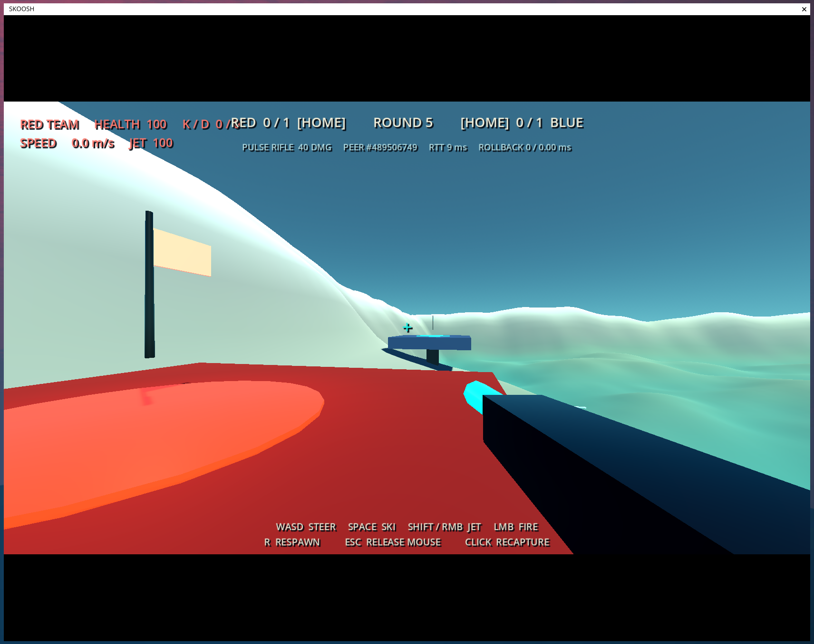

# SKOOSH

A Godot 4 momentum-skiing, jet-assisted, authoritative multiplayer CTF prototype.



Start with [`docs/CHECKPOINT.md`](docs/CHECKPOINT.md) for current project state
and [`docs/README.md`](docs/README.md) for the documentation map.

## Run from source

Godot 4.4+ is required. For one local server and two clients, the helper defaults to the temporary development binary when present:

```bash
./tools/run_multiplayer_demo.sh
```

This starts one headless authoritative server and two graphical clients on UDP 9077. Focus one client window at a time. Press Ctrl-C in the launching terminal to stop the complete session.

Override the engine path or port when needed:

```bash
GODOT_BIN=/path/to/Godot SKOOSH_PORT=9078 ./tools/run_multiplayer_demo.sh
```

SKOOSH uses Forward+ with the balanced presentation profile by default. Compare its feature tiers with:

```bash
SKOOSH_RENDERER_PROFILE=lean ./tools/run_multiplayer_demo.sh
SKOOSH_RENDERER_PROFILE=showcase ./tools/run_multiplayer_demo.sh
```

See [`docs/decisions/FORWARD_PLUS_EVALUATION.md`](docs/decisions/FORWARD_PLUS_EVALUATION.md) for renderer evidence, limitations, and the adopted feature policy.

Connect two local clients to any direct host with:

```bash
./tools/run_remote_clients.sh play.example.com
```

The lobby and `--join=HOST --port=PORT` arguments also support one-client connections.

## Run from a GitHub Release

Download the client archive for Linux, Windows, or macOS from [GitHub Releases](https://github.com/jakswa/skoosh/releases), extract it, and launch the executable. Enter the server hostname and UDP port `9077` in the lobby. Release clients and servers must use the same version tag.

Linux can also connect directly with:

```bash
./skoosh.x86_64 -- --join=server.example.com --port=9077
```

The current macOS build is ad-hoc signed but not Apple-notarized, so Gatekeeper may require right-clicking the app and selecting **Open**.

See [`docs/operations/PLAYTESTING_AND_DISTRIBUTION.md`](docs/operations/PLAYTESTING_AND_DISTRIBUTION.md) for complete source/release client workflows. Give server operators [`docs/operations/SERVER_DEPLOYMENT.md`](docs/operations/SERVER_DEPLOYMENT.md), which covers Git and prebuilt-binary installs, systemd, UDP forwarding, updates, and verification.

### Controls

- WASD: move and steer
- Space: ski
- Shift or right mouse: jet; at low grounded speed this includes a fuel-costed upward pop
- Left mouse: fire selected weapon
- 1-4: disc, grenade launcher, gatling gun, sniper rifle
- V, then number keys: voice commands; press T or G in the menu for TEAM or GLOBAL comms
- F3: network telemetry
- R: authoritative respawn
- Esc: release mouse
- Click client window: recapture mouse

### CTF loop

Clients are balanced between RED and BLUE. Take the opposing flag and return to the glowing ring on your raised team platform while your flag is home. Death drops a carried flag; teammates return their dropped flag by touching it, otherwise it returns after ten seconds. The compact demo is sudden death: one capture wins, followed by a five-second intermission and a fresh round.

## Automated checks

```bash
./tools/test_ground_jet.sh
./tools/test_oob_recovery.sh
./tools/test_multiplayer_demo.sh       # about 51 seconds
```

The multiplayer test takes about 51 seconds and validates two-team spawning, all four authoritative weapon paths, cross-peer global voice relay, death/respawn, ski/jet movement, a flag capture, win state, and round restart.

For off-screen visual and UX review, Compatibility uses `./tools/capture_visual_qa.sh`; Forward+ uses `./tools/capture_visual_qa_private_wayland.sh` with a private headless Weston compositor. Neither opens desktop windows or captures the host mouse. See [`docs/production/VISUAL_QA.md`](docs/production/VISUAL_QA.md).

The original solo time-trial remains available as `res://scenes/main.tscn`; the multiplayer CTF scene is the project entry point.

## Current network boundary

The server owns movement results, energy, weapon selection and cadence, projectile impacts, hitscan traces, damage, teams, flags, score, team/global voice routing and rate limits, and rounds. Clients predict projectile and firing presentation only; the server reconstructs projectile launches and hitscan rays from its authoritative muzzle and aim. See [`docs/engineering/COMBAT_NETWORKING_ROADMAP.md`](docs/engineering/COMBAT_NETWORKING_ROADMAP.md) and [`docs/CHECKPOINT.md`](docs/CHECKPOINT.md).
